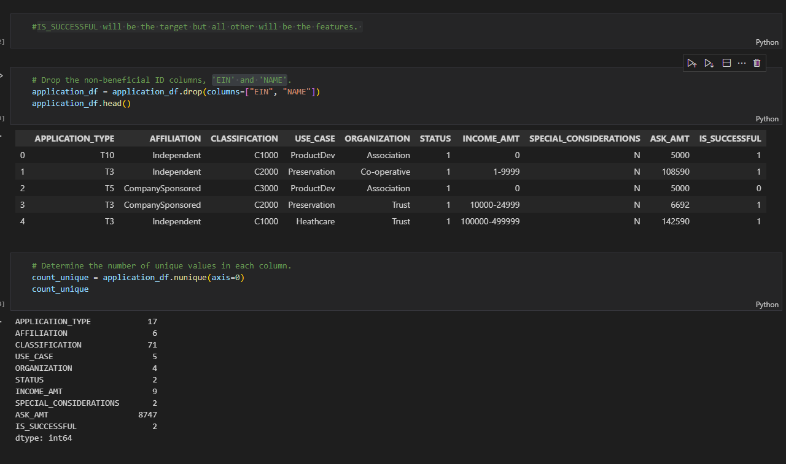
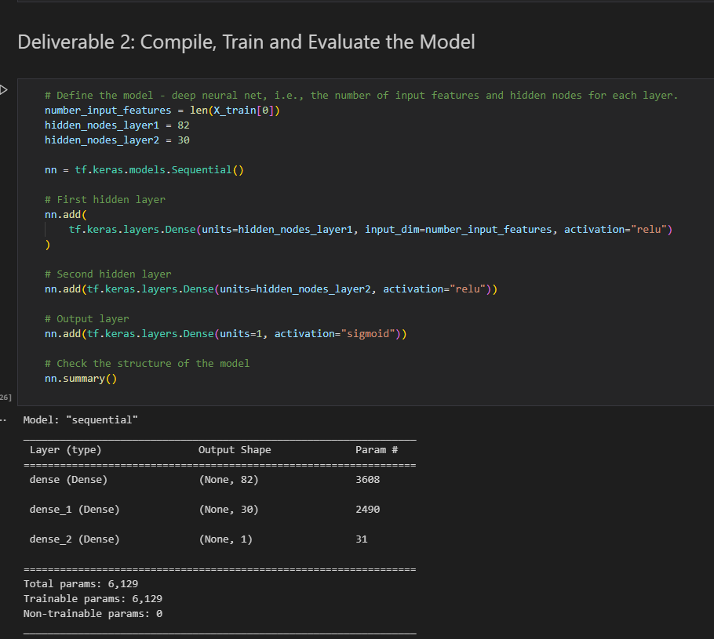

# Neural_Network_Charity_Analysis

## Overview of Project 
In this module, we were introduced to a data scientist called Beks from Alphabet Soup. She was tasked with developing a model to predict sound investments.  To help Beks we learned to build neural networks in Python using the TensorFlow library.  

### Purpose
The purpose of this analysis was to "help Beks create a binary classifier that is capable of predicting whether applicants will be successful if funded by Alphabet Soup" (Canvas, module 20 challenge).

## Results
Data was colleccted using Tensorflow, python, mlenv, Scikit-learn, and Keras, pandas, and matplotlib. 

    Data Preprocessing
        What variable(s) are considered the target(s) for your model?
        The IS_SUCCESSFUL column was considered to be the target for the model.  

        What variable(s) are considered to be the features for your model?
        All other columns except fot the 'EIN' and 'NAME' columns were considered to be the features for this model. 

        What variable(s) are neither targets nor features, and should be removed from the input data?
        The 'EIN' and 'NAME' columns were not considered to be targets or features. 

    Compiling, Training, and Evaluating the Model
        How many neurons, layers, and activation functions did you select for your neural network model, and why?
        82 and 30 neuron layers were used. Also, the relu and sigmoid activation functions were used for this project. 

        Were you able to achieve the target model performance?
        No, I was not able to achieve the target model performance.

        What steps did you take to try and increase model performance?
        I tried using a different model.  I also tried changing the number of hiden layers.

## Summary
I would recommend testing different hidden layers and activation functions. 

Resources:
Canvas. Module 20 Challenge. 2022 edX Boot Camps LLC. All Rights Reserved.